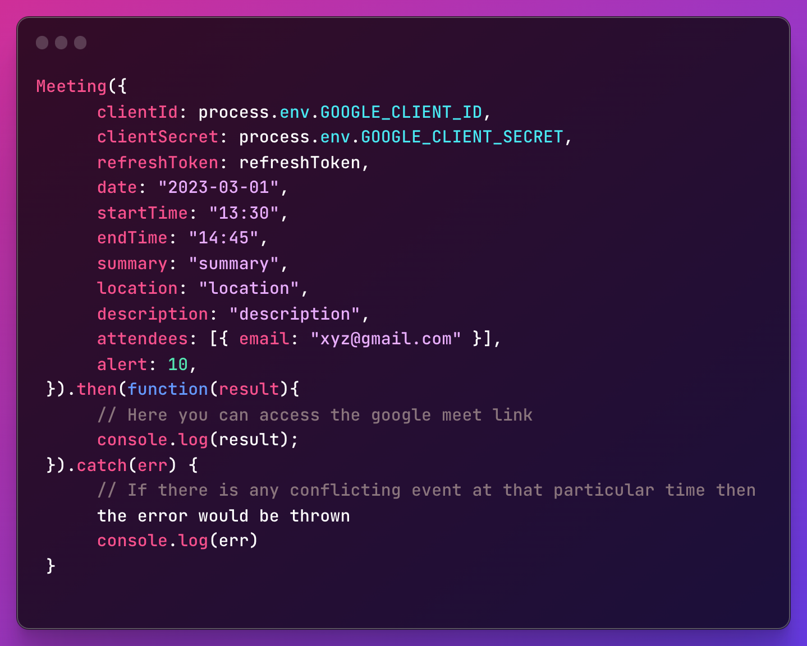

# NodeJs Google-calendar-meet-api

[](https://choosealicense.com/licenses/mit/)

An Api to help you create google meet links and create an event on the calendar with this link you created.

# Install


# Javascript Usage
1) You will have to get the google api credentials ```CLIENT_ID``` and ```CLIENT_SECRET```
2) You will also need to enable the google calendar api in the api services on google cloud platform.
3) Generate a refresh token using google authentication strategies.

## Add this to the top of your file.


# Easy Usage




## Available Attributes
<table>
  <tr>
    <th>Attributen Name</th>
    <th>Type</th>
    <th>Example</th>
  </tr>
  <tr>
    <td>ClientId</td>
    <td>String</td>
    <td>XXXXXXXXXXXXXXXs8fu9kv9u1.apps.googleusercontent.com</td>
  </tr>
  <tr>
    <td>clientSecret</td>
    <td>String</td>
    <td>XXXXXXXXXLoNFnXXXXXXTIUjRXXXXXXXXX</td>
  </tr>
  <tr>
    <td>refreshToken</td>
    <td>String</td>
    <td>XXXXXXXXXCNXXXXMGvJUXXXXV7LplXAXXXX</td>
  </tr>
  <tr>
    <td>date</td>
    <td>String</td>
    <td>2023-03-01</td>
  </tr>
  <tr>
    <td>date</td>
    <td>String</td>
    <td>2023-03-01</td>
  </tr>
  <tr>
    <td>startTime</td>
    <td>String (24Hr Format)</td>
    <td>"01:30"</td>
  </tr>
  <tr>
    <td>endTime</td>
    <td>String (24Hr Format)</td>
    <td>"03:45"</td>
  </tr>
  <tr>
    <td>summary</td>
    <td>String</td>
    <td>summary</td>
  </tr>
  <tr>
    <td>location</td>
    <td>String</td>
    <td>location</td>
  </tr>
  <tr>
    <td>description</td>
    <td>String</td>
    <td>description</td>
  </tr>
  <tr>
    <td>attendees</td>
    <td>Array [{email: String}]</td>
    <td>[{email: "xyz@gmail.com"}]</td>
  </tr>
  <tr>
    <td>alert</td>
    <td>Number</td>
    <td>10 (how many minutes before do you want to receive an alert)</td>
  </tr>
</table>